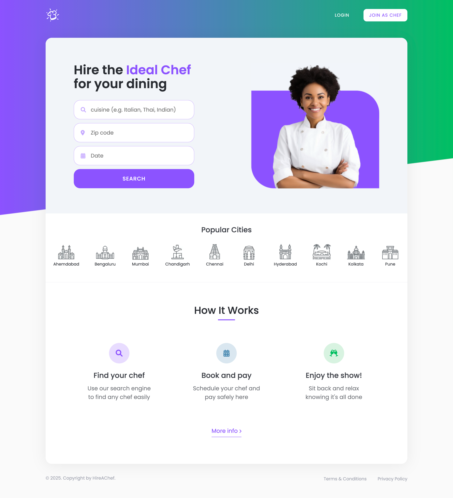
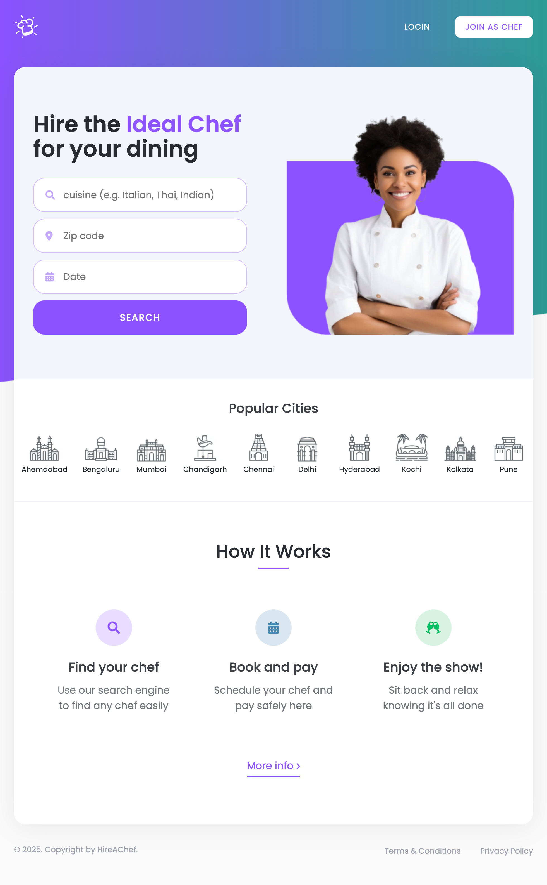
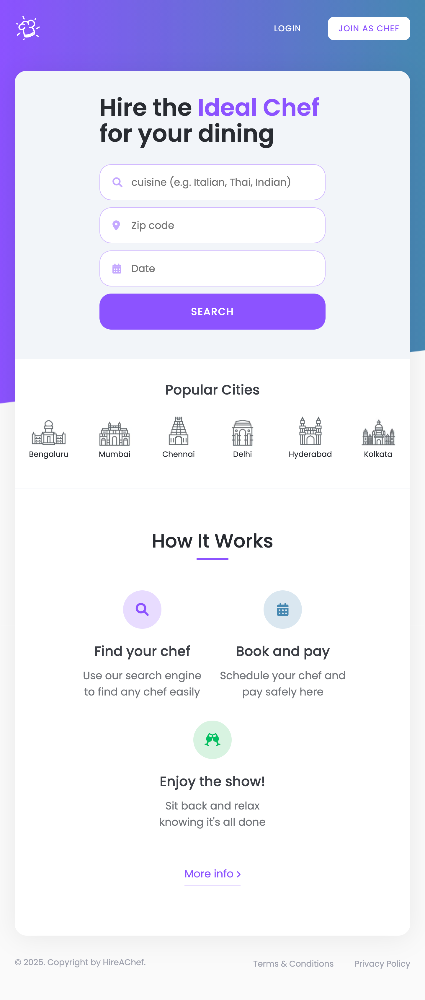
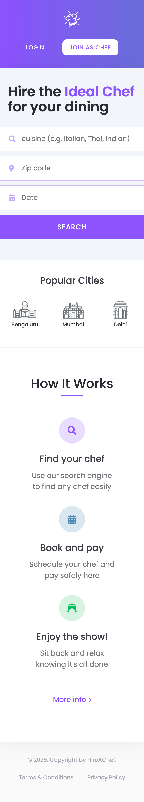

# HireAChef

This project presents a design concept for a website dedicated to hiring chefs. The implementation focuses on clean, maintainable code using pure CSS. All animations and effects are achieved without the use of JavaScript.

## Key Features
- Pure CSS Animations: Utilizing keyframes for creating smooth and engaging animations.
- Responsive Design: Implementing media queries to ensure seamless transitions between mobile and laptop screens.
- Wide Range Display Support: The design is optimized to provide a consistent and visually appealing experience across various display platforms, from small mobile devices to large desktop monitors.

The major focus is on delivering a visually appealing and functional user experience with efficient, straightforward code.

## Demo

  <strong>1440px (MacBook Pro)</strong> 
  

  <strong>980px (iPad Pro)</strong> 
  

  <strong>720px (iPad Mini)</strong> 
  

  <strong>480px (iPhone 14 Pro)</strong> 
  

  <strong>360px (iPhone SE)</strong> 
  

